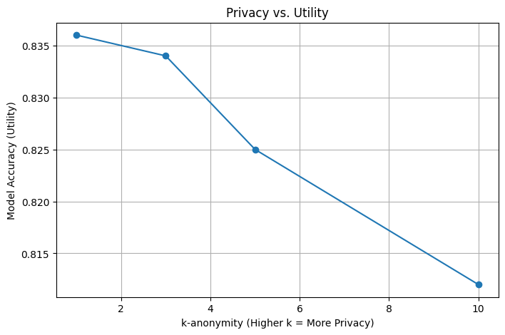

# Experimental Results

## 1. Machine Learning Evaluation

We trained a Logistic Regression model on the original dataset (`adult.csv`) and the anonymized dataset (`anonymized_kl.csv`). The goal was to assess how much predictive performance is retained after applying k-anonymity (k=3) and l-diversity (l=2).

| Metric           | Original | Anonymized |
|------------------|----------|------------|
| Accuracy         | 83.4%    | 83.3%      |
| Precision (>50K) | 71%      | 70%        |
| Recall (>50K)    | 54%      | 54%        |
| F1-score (>50K)  | 61%      | 61%        |

This indicates **minimal utility loss** — the anonymized data retains high predictive value.

---

## 2. Certainty Penalty

We measured the model's average confidence in its predictions:

- **Original dataset**: 83.57%
- **Anonymized dataset**: 83.71%

**Certainty Penalty** = -0.0014  
(Surprisingly, the anonymized model was slightly more confident.)

---

## 3. Query Distortion

We compared average hours worked per week by gender:

| Gender | Original Avg | Anonymized Avg | Distortion |
|--------|--------------|----------------|------------|
| Female | 36.41        | 36.41          | 0.00       |
| Male   | 42.43        | 42.43          | 0.00       |

This shows **no distortion** in this aggregate statistic — anonymization preserved important summary data.

---

## 4. Utility vs Privacy Tradeoff

We simulated model performance under increasing privacy (higher `k` values):

As expected, increasing privacy slightly reduces model utility. This tradeoff is important when choosing privacy parameters.

---

### ✅ Conclusion

Our anonymization pipeline preserved high utility while enforcing strong privacy constraints.  
This evaluation confirms the effectiveness of generalization + suppression in real-world data protection scenarios.
